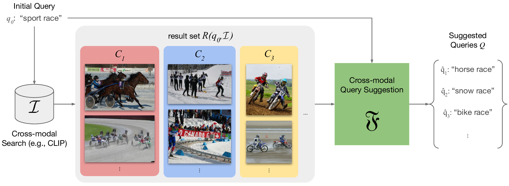
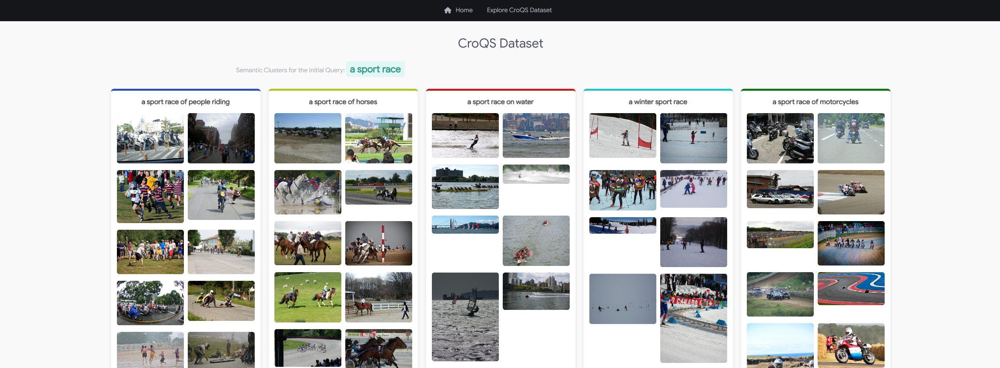

# Maybe you are looking for CroQS 🐊
## Cross-modal Query Suggestion for Text-to-Image Retrieval

[Project page](https://paciosoft.com/CroQS-benchmark/) |  | 

Official repository of the paper "Maybe you are looking for CroQS 🐊 Cross-modal Query Suggestion for Text-to-Image Retrieval".

#### Updates

- 🔥 12/2024: "Maybe you are looking for CroQS 🐊 Cross-modal Query Suggestion for Text-to-Image Retrieval" has been accepted to ECIR2025 as a full paper

### Abstract

Query suggestion, a technique widely adopted in information retrieval, enhances system interactivity and the browsing experience of document collections.
In cross-modal retrieval, many works have focused on retrieving relevant items from natural language queries, while few have explored query suggestion solutions. 

In this work, we address query suggestion in cross-modal retrieval, introducing a novel task that focuses on suggesting minimal textual modifications needed to explore visually consistent subsets of the collection, following the premise of ”Maybe you are looking for”.
To facilitate the evaluation and development of methods, we present a tailored benchmark named CroQS.
This dataset comprises initial queries, grouped result sets, and human-defined suggested queries for each group.
We establish dedicated metrics to rigorously evaluate the performance of various methods on this task, measuring representativeness, cluster specificity, and similarity of the suggested queries to the original ones.
Baseline methods from related fields, such as image captioning and content summarization, are adapted for this task to provide reference performance scores.

Although relatively far from human performance, our experiments reveal that both LLM-based and captioning-based methods achieve competitive results on CroQS, improving the recall on cluster specificity by more than 115% and representativeness mAP by more than 52% with respect to the initial query.

---

## Repo content

In this repository you can find:
- the CroQS dataset as a json file
- a [browsable version](./browsable-dataset/index.html) of the dataset, in HTML format
- the CroQS python class, which is the main entrypoint for benchmark usage
- an implementation of the set of baseline methods (ClipCap, DeCap and GroupCap)
- a couple of Jupyter Notebooks, [one](./benchmark-examples.ipynb) that report an usage example of the CroQS class to explore the dataset, and [the other](./evaluation.ipynb) that shows how to run evaluation experiments through it

## Explore CroQS 🐊

Open in a browser the [CroQS browsable dataset index file](./browsable-dataset/index.html) and explore the queries and clusters.

## Setup

#### Prerequisites

To run the evaluation experiments you will need:
- CUDA driver (check if everything works by typing `nvidia-smi`)

#### Steps

In order to run the code of this repo, 

1. create a new virtual environment (recommended):
`conda create --name croqs python==3.8` and then activate it `conda activate croqs`
2. clone the repository and `cd` into it
3. install the dependencies in requirements.txt: `pip3 install -r requirements.txt`

Now you can open the `ipynb` benchmark-examples and browse the dataset, while to test the methods and measure their scores over the CroQS Benchmark, you have to follow the following further steps:

4. download coco dataset
5. create a `.env` file from the `.env.example` and update it with the real paths to coco dataset. In particular the `.env` entries should contain:
    - `REPO_DIRECTORY_ROOT` &#8594; the path to the CroQS-Benchmark repository
    - `DATA_DIRECTORY_ROOT` &#8594; the path to a folder that should contain the directories `coco-dataset`, `decap`, `hdf5-indexes`. The folder `decap` should contain the `decoder_config.pkl` file provided by DeCap authors, and a folder `coco_model` which should contain the trained DeCap over the coco-dataset provided by DeCap authors. The folder `coco-dataset` should contain the coco-dataset images of train and validation splits and the `annotations` folder, with the information for train and validation subsets. The folder `hdf5-indexes` should contain a file such as `coco_train_val_2017_image_embeddings.h5` that can be built by indexing the coco dataset through the index method of the class `RetrievalSystem`.
    - `CLIPCAP_ENABLED` &#8594; can be either 1 / True or 0 / False, when is False, the ClipCap model is not loaded (useful for debug / VRAM economy)
    - `HF_TOKEN` &#8594; here you can set your HuggingFace API Token, so that you can download HuggingFace models from their server (such as Mistral and LLama3, that are required by the GroupCap method)
    - `HDF5_INDEX_FILE_PATH` &#8594; here you should set the full path to the file in the folder `hdf5-indexes` such as `coco_train_val_2017_image_embeddings.h5`, which should contain the hdf5 index file of the image collection.
    - `IM2TXT_PROJECTOR_MEMORY_HDF5_FILE_PATH` &#8594; here you should provide a valid and existing path to a folder where the class `Im2TxtProjection` will build the projection memory for the DeCap method. This should also include the hdf5 file name, which should be `{}_text_embeddings.h5` and will be auto-formatted by the method.
6. Run the file `evaluation.ipynb`. Some models will prompt you to download additional files and configurations. 

## Acknowledgements

This work has received financial support by:
- the project FAIR – Future Artificial Intelligence Research - Spoke 1 (PNRR M4C2 Inv. 1.3 PE00000013) funded by the European Union - Next Generation EU.
- the European Union — Next Generation EU, Mission 4 Component 1 CUP B53D23026090001 (a MUltimedia platform for Content Enrichment and Search in audiovisual archives — MUCES PRIN 2022 PNRR P2022BW7CW).
- the Spoke "FutureHPC & BigData" of the ICSC – Centro Nazionale di Ricerca in High-Performance Computing, Big Data and Quantum Computing funded by the Italian Government.
- the FoReLab and CrossLab projects (Departments of Excellence), the NEREO PRIN project (Research Grant no. 2022AEFHAZ) funded by the Italian Ministry of Education and Research (MUR).

Dataset and images provided by [COCO Dataset]("http://cocodataset.org") (Common Objects in Context), licensed under [CC BY 4.0](https://creativecommons.org/licenses/by/4.0/).
